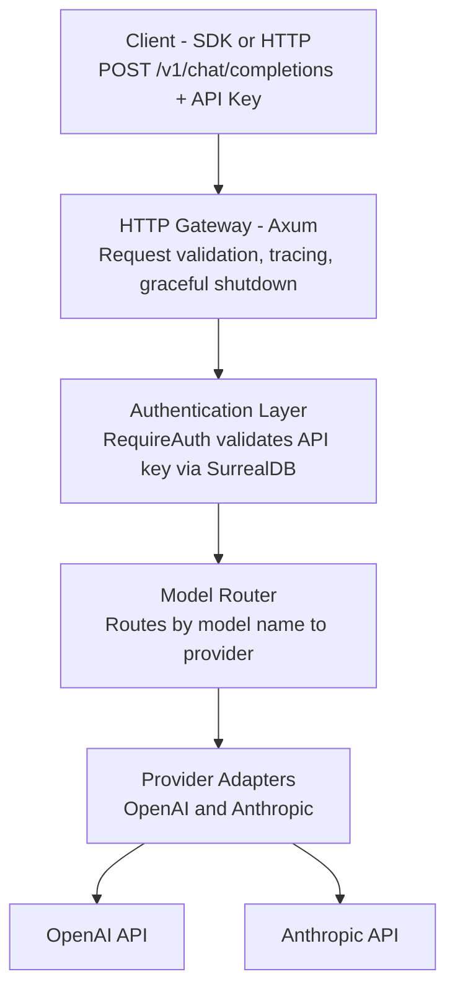
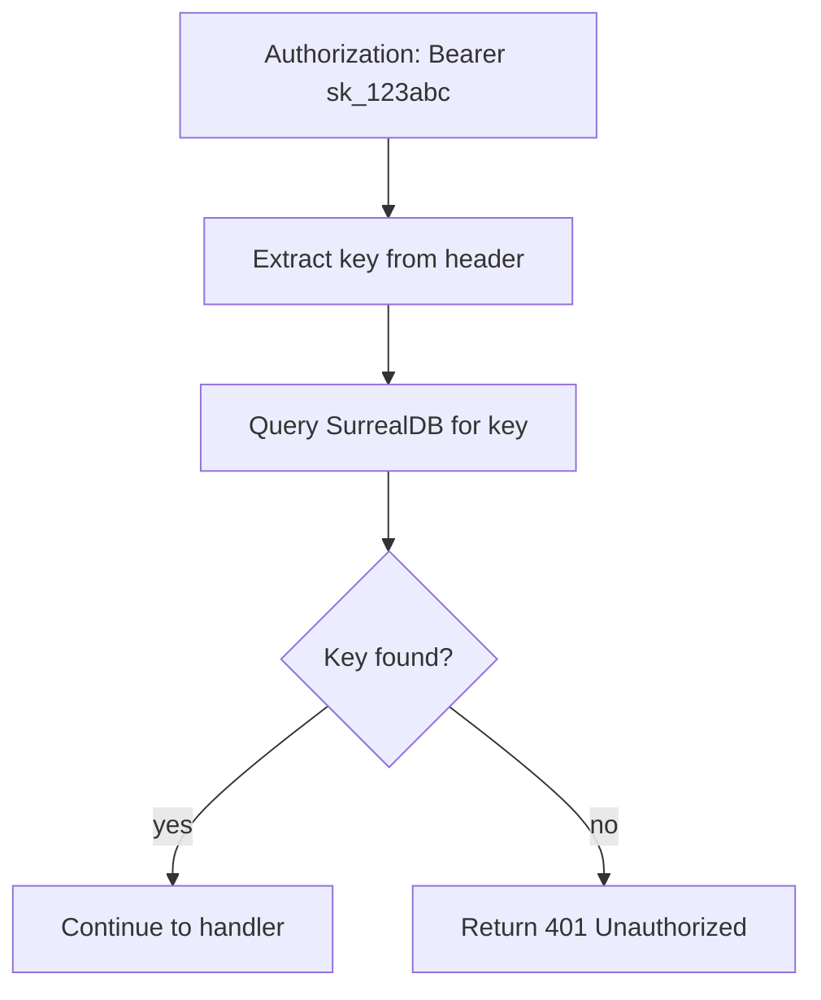
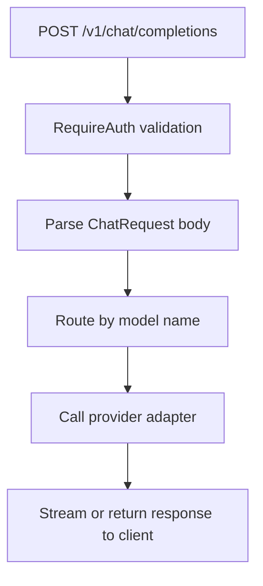
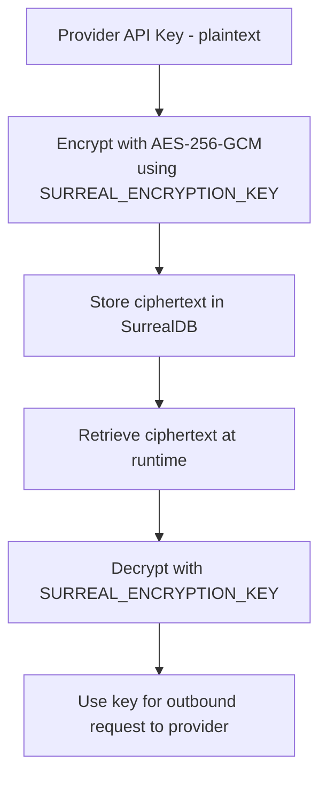
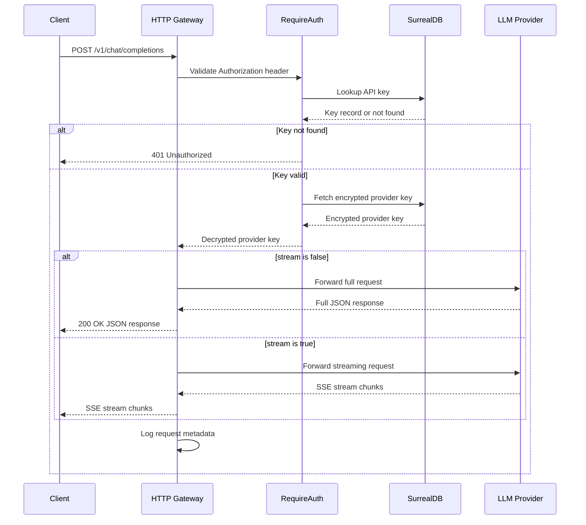
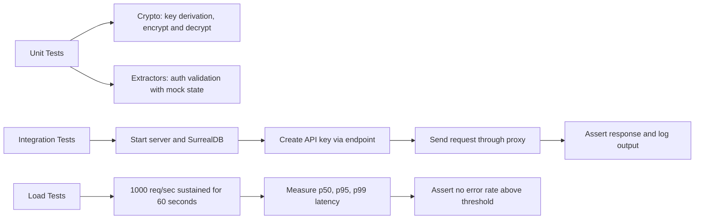

# Architecture Overview

ValyMux is structured in three main layers: **HTTP Gateway**, **Routing & Auth**, and **Persistence**.

## System Diagram



## Layer Details

### 1. HTTP Gateway (`src/main.rs` + `src/sys/init.rs`)

**Responsibility:** Start server, bind to port, handle lifecycle.

```rust
// Axum router setup
let app = Router::new()
    .route("/", get(health))
    .nest("/v1", v1_routes())
    .layer(middleware::from_fn(trace_middleware))
    .with_state(app_state);
```

**What happens:**
- Tokio listens on `0.0.0.0:3000`
- Registers signal handlers (SIGINT, SIGTERM)
- Gracefully shuts down when signal received
- All traffic flows through the router

---

### 2. Request Handler Layer (`src/rts/`)

**Responsibility:** Parse requests, extract data, call services.

#### `extractors.rs` — The `RequireAuth` Guard

```rust
pub struct RequireAuth {
    pub api_key: String,
}

#[async_trait]
impl FromRequestParts for RequireAuth {
    async fn from_request_parts(parts, state) -> Result<Self, ...> {
        // 1. Extract "Authorization: Bearer <key>" header
        // 2. Look up key in SurrealDB
        // 3. Return error if not found
    }
}
```

**Flow:**



#### `v1/` — OpenAI-compatible endpoints



---

### 3. Provider Adapters (`src/svc/proxy/`)

**Responsibility:** Talk to upstream LLM APIs.

#### `openai.rs`

```rust
pub struct OpenAIProxy {
    client: HttpClient,
    api_key: String,
}

impl OpenAIProxy {
    async fn forward(&self, req: ChatRequest) -> ChatResponse {
        // 1. Add our API key to request
        // 2. POST to api.openai.com/v1/chat/completions
        // 3. Return response directly to caller
    }
}
```

**Why separate?** Easy to add Anthropic, Cohere, etc. later.

---

### 4. Persistence Layer (`crates/surrealdb/`)

**Responsibility:** Store and retrieve data securely.

#### Schema

**api_keys table**

| Field | Type | Notes |
|-------|------|-------|
| id | string | Primary key |
| user_id | string | Owner |
| name | string | Human label |
| key_hash | string | PBKDF2, never plaintext |
| provider | string | openai, anthropic, etc. |
| provider_key | string | Encrypted with AES-256-GCM |
| created_at | datetime | |

**requests table (planned)**

| Field | Type | Notes |
|-------|------|-------|
| id | uuid | |
| api_key_id | string | FK to api_keys |
| model | string | |
| prompt_tokens | i32 | |
| completion_tokens | i32 | |
| latency_ms | i32 | |
| timestamp | datetime | |

#### Crypto (`crates/surrealdb/src/crypto.rs`)



**Why?** If someone steals your database, they cannot recover provider keys without the encryption key.

---

### 5. Observability (`crates/telemetry/`)

**Responsibility:** Log and trace everything.

#### Log Formats

| Format | Best For | Output |
|--------|----------|--------|
| `json` | Production, log aggregators (ELK, Datadog) | Single-line JSON per event |
| `compact` | Development terminals | Single-line, human-readable |
| `pretty` | Debugging | Multi-line with full field context |

#### Example Trace

```rust
info!(
    request_id = %uuid,
    model = "gpt-4",
    latency_ms = 1250,
    "Request completed"
);
```

---

## Request Lifecycle



---

## File Organization

```
src/
├── main.rs                    entry point, listener bind, graceful shutdown
├── lib.rs                     module declarations
├── sys/
│   ├── config.rs              AppConfig loaded from env vars via envy
│   ├── init.rs                AppState, HTTP client, TCP listener setup
│   ├── state.rs               Arc<AppState> shared across handlers
│   └── client.rs              HttpClient trait and implementation
├── rts/
│   ├── root.rs                GET / health check
│   ├── extractors.rs          RequireAuth extractor
│   ├── v1.rs                  POST /v1/chat/completions
│   └── v1/                    sub-handlers for /v1/*
└── svc/
    └── proxy/
        ├── mod.rs
        ├── types.rs           shared request/response types
        ├── openai.rs          OpenAI provider adapter
        └── anthropic.rs       Anthropic provider adapter

crates/
├── core/
│   └── error.rs               AppError, IntoResponse impl
├── surrealdb/
│   └── src/
│       ├── config.rs          SurrealDB connection config
│       ├── models.rs          table schemas
│       ├── schema.rs          SurrealDB query definitions
│       └── crypto.rs          PBKDF2, AES-256-GCM
└── telemetry/
    └── src/
        ├── init.rs            tracing-subscriber initialisation
        └── models.rs          log format config
```

---

## Key Design Decisions

| Decision | Why |
|----------|-----|
| Axum over Actix/Rocket | Minimal, composable, Tokio-native, tower-compatible middleware |
| SurrealDB over PostgreSQL | Document-oriented, built-in auth, WebSocket, simpler single-binary deploy |
| AES-256-GCM for storage | Industry-standard AEAD cipher; provides authenticated encryption |
| PBKDF2 for key derivation | NIST-approved, FIPS-compliant |
| Workspace crates | Clear separation of concerns; telemetry and core are independently reusable |
| Graceful shutdown | In-flight requests finish before the port closes |

---

## Scaling Considerations

**Current:** Single binary + single SurrealDB instance.

**To scale horizontally:**
1. Run multiple ValyMux instances behind a load balancer
2. Add Redis for API key lookup caching (removes per-request DB round-trip)
3. Use `tokio::spawn` for non-blocking observability writes
4. Add request buffering via channels when upstream is slow
5. Add a circuit breaker to auto-disable a provider on repeated failures

---

## Testing Strategy



---

## Observability Checklist

- [x] Structured logs (JSON / pretty / compact)
- [x] Per-request tracing (tower-http middleware)
- [x] Error context (AppError spans)
- [ ] Prometheus metrics endpoint (`/metrics`)
- [ ] Health check with DB liveness (`/` returns 503 if SurrealDB unreachable)
- [ ] Graceful degradation on SurrealDB unavailability

---

## Security Checklist

- [x] Encryption at rest (AES-256-GCM for provider keys)
- [x] Encryption in transit (HTTPS/WSS recommended for all deployments)
- [x] API key validation (RequireAuth extractor on all protected routes)
- [x] No plaintext secrets in logs (structured fields, secrets never traced)
- [ ] Rate limiting per API key
- [ ] Request signing
- [ ] Audit logging for key creation and deletion
